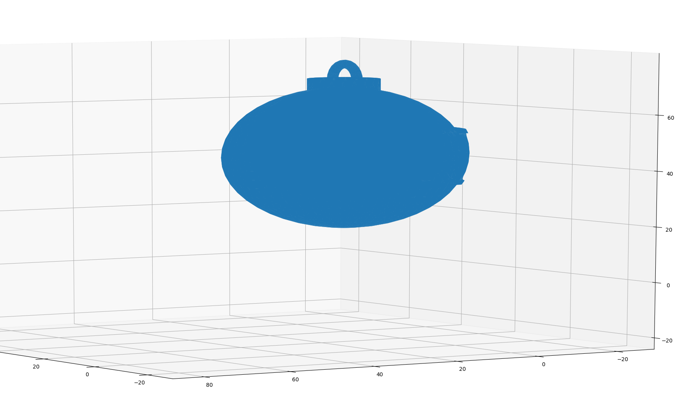
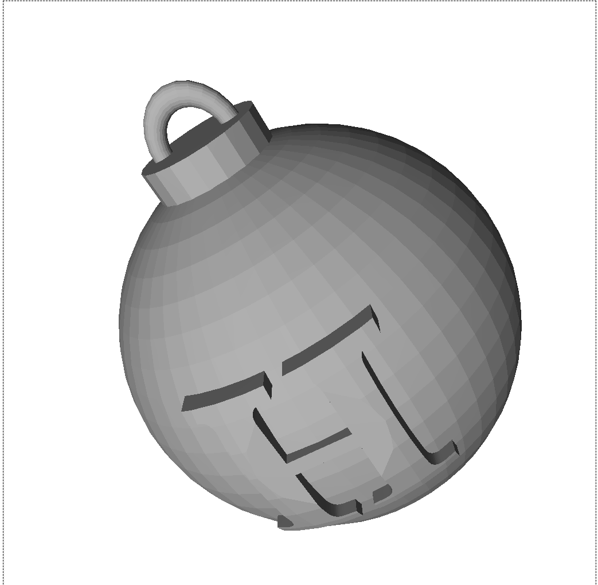
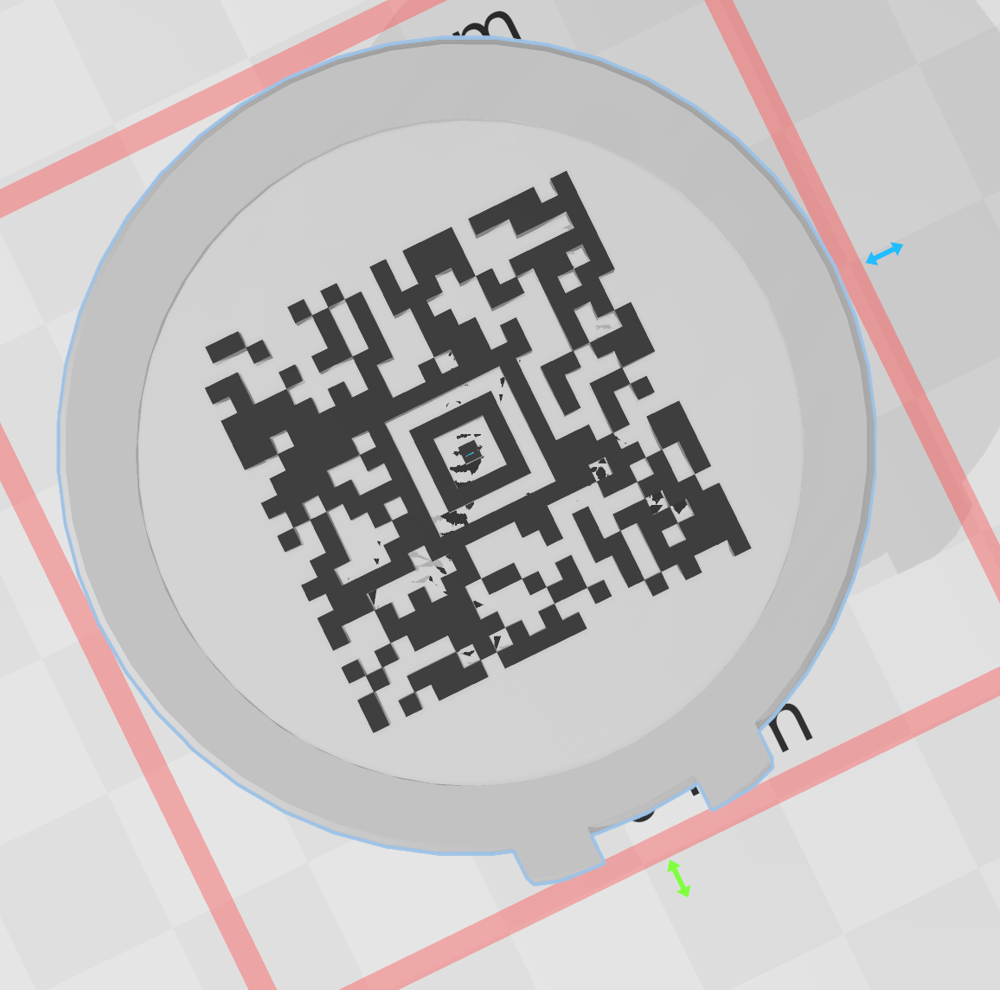

# HV19.02 Triangulation

**Task:** Today we give away decorations for your Christmas tree. But be careful and do not break it.

[HV19.02-Triangulation.zip](https://academy.hacking-lab.com/api/media/challenge/zip/a5f47ab8-f151-4741-b061-d2ab331bf641.zip)

**Flag:** `HV19{Cr4ck_Th3_B411!}`

## Research

 `.stl`-files are "stereolithography" files and used in 3D-modeling and CAD. Wikipedia has more about the structure of STL files:

```
UINT8[80] – Header is 80 char long
UINT32 – Number of triangles, 4 byte little endian
foreach triangle
    REAL32[3] – Normal vector
    REAL32[3] – Vertex 1
    REAL32[3] – Vertex 2
    REAL32[3] – Vertex 3
    UINT16 – Attribute byte count
end
```

A hex-editor check confirms the correct file format.

A first python script (following `numpy_stl`'s quickstart) produces an image.

```python
import numpy
from stl import mesh
from mpl_toolkits import mplot3d
from matplotlib import pyplot

my_mesh = mesh.Mesh.from_file("tr_ascii.stl")

def plot_figure(mesh):
    figure = pyplot.figure()
    axes = mplot3d.Axes3D(figure)
    axes.add_collection3d
		(mplot3d.art3d.Poly3DCollection(mesh.vectors))
    scale = mesh.points.flatten(-1)
    axes.auto_scale_xyz(scale, scale, scale)
    pyplot.show()

volume, cog, inertia = my_mesh.get_mass_properties()
print("Volume                                  = {0}".format(volume))
print("Position of the center of gravity (COG) = {0}".format(cog))
print("Inertia matrix at expressed at the COG  = 
      0}".format(inertia[0,:]))
print("                   
      {0}".format(inertia[1,:]))
print("                   
      {0}".format(inertia[2,:]))

plot_figure(my_mesh)
```

Results in:



There's something on the surface, but more isn't visible.

https://www.meshconvert.com/ allows to convert the binary stl-file to ASCII-format, which makes it much more readable.

https://www.viewstl.com/ allows to see the whole texture. We now see an "H" written on the bulb itself, however, there's no flag. If we activate the wireframe option on the site, it reveals something like a QR-code hidden within the bulb. I feel a disco vibe here!



I considered writing a script to eliminate all points around the code but then pursued another, easier path. I didn't want to learn how to use Blender or any other of those CAD/3D-modeling programs, and luckily, a hint guided me to the easiest solution: dear Windows!

Windows 10 ships with a program called "3D Builder" (yeah, we laughed all when it was introduced, but damn, thank you Microsoft!). It is highly intuitive and makes it easy to chop off the top and bottom half of the bulb to reveal the QR-code.



But.

BUT! 

This isn't a "QR-code"! 

There are lots of other "2D"-codes beside QR, and this one is called the "Aztec Code": 
https://en.wikipedia.org/wiki/Aztec_Code

Welcome to my personal rabbit hole.

In the end, after enabling the Aztec code on my scanner app, I finally got the flag.