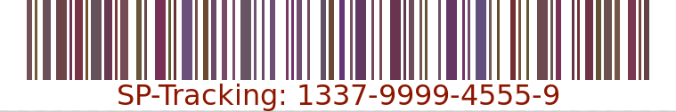

# HV19.05 Santa Parcel Tracking

**Task:** To handle the huge load of parcels Santa introduced this year a parcel tracking system. He didn't like the black and white barcode, so he invented a more solemn barcode. Unfortunately the common barcode readers can't read it anymore, it only works with the pimped models santa owns. Can you read the barcode?



**Flag:** `HV19{D1fficult_to_g3t_a_SPT_R3ader}`

## Research

Scanning the code reveals: Code 128 as a format, Type: Text, and the text `"not the solution"`. THAT would have been too easy.

The code `1337-9999-4555-9` also doesn't correspond to the barcode in the image: 
https://barcode.tec-it.com/en/Code128?data=1337-9999-4555-9

The colors are in various, but similar hues. After cropping the image to just the barcode, ImageMagick reveals its properties:

```bash
$ identify -verbose barcode_colorsonly.png
Image: barcode_colorsonly.png
  Format: PNG (Portable Network Graphics)
  Mime type: image/png
  Class: DirectClass
  Geometry: 699x90+0+0
  Resolution: 72x72
  Print size: 9.70833x1.25
  Units: PixelsPerInch
  Type: Palette
  Endianess: Undefined
  Colorspace: sRGB
  Depth: 8-bit
  Channel depth:
    red: 8-bit
    green: 8-bit
    blue: 8-bit
  Channel statistics:
    Pixels: 62910
    Red:
      min: 97 (0.380392)
      max: 255 (1)
      mean: 177.146 (0.69469)
      standard deviation: 73.204 (0.287075)
      kurtosis: -1.96534
      skewness: 0.111954
      entropy: 0.712714
    Green:
      min: 48 (0.188235)
      max: 255 (1)
      mean: 156.185 (0.612488)
      standard deviation: 93.1526 (0.365304)
      kurtosis: -1.94628
      skewness: 0.096035
      entropy: 0.70323
    Blue:
      min: 48 (0.188235)
      max: 255 (1)
      mean: 164.326 (0.644416)
      standard deviation: 86.3827 (0.338756)
      kurtosis: -1.88114
      skewness: 0.0358523
      entropy: 0.688058
  Image statistics:
    Overall:
      min: 48 (0.188235)
      max: 255 (1)
      mean: 165.886 (0.650532)
      standard deviation: 84.6527 (0.331971)
      kurtosis: -1.83624
      skewness: 0.0212909
      entropy: 0.701334
  Colors: 65
  Histogram:
       270: ( 97, 56, 84) #613854 srgb(97,56,84)
       540: ( 97, 81,103) #615167 srgb(97,81,103)
       540: ( 97, 83, 51) #615333 srgb(97,83,51)
       270: ( 97, 88, 49) #615831 srgb(97,88,49)
      1080: ( 98, 57, 97) #623961 srgb(98,57,97)
     --- moar numbers ---
       810: (121, 56, 80) #793850 srgb(121,56,80)
      1080: (122, 48, 86) #7A3056 srgb(122,48,86)
       270: (122, 57, 52) #7A3934 srgb(122,57,52)
       270: (122, 73,105) #7A4969 srgb(122,73,105)
     29430: (255,255,255) #FFFFFF white
  Rendering intent: Perceptual
  Gamma: 0.454545
  Chromaticity:
    red primary: (0.64,0.33)
    green primary: (0.3,0.6)
    blue primary: (0.15,0.06)
    white point: (0.3127,0.329)
  Background color: white
  Border color: srgb(223,223,223)
  Matte color: grey74
  Transparent color: black
  Interlace: None
  Intensity: Undefined
-- moar irrelevant information follows --

```

The numbers look suspiciously like ASCII-numbers since they're all in a similar range, conforming to the similarity in hue.

| Entry | HEX     | RGB              |
| ----- | ------- | ---------------- |
| 1     | #735058 | rgb(115, 80, 88) |
| 2     | #745938 | rgb(116, 89, 56) |
| 3     | #6C5059 | rgb(108, 80, 89) |
| 4     | #6D4549 | rgb(109, 69, 73) |
| 5     | #72314F | rgb(114, 49, 79) |
| last  | #654245 | rgb(101, 66, 69) |

We know how the beginning and end of the flag must look like:

| char | dec  | hex  |
| ---- | ---- | ---- |
| H    | 72   | 0x48 |
| V    | 86   | 0x56 |
| 1    | 49   | 0x31 |
| 9    | 57   | 0x39 |
| {    | 123  | 0x7B |
| ...  |      |      |
| }    | 125  | 0x7D |

But this corresponds in no way to what we see in ImageMagick's output, there's none of the characters in `115, 80, 88`, i.e. the first entry.

Still, following the description, the flag must be in these RGB codes somehow. I then wrote a Python script to convert all the RGB values to characters - this revealed the flag:

```python
from PIL import Image
import itertools

def remove_whitespace(values):
    return list(itertools.filterfalse
                (lambda x: x == tuple([255, 255, 255]), values))

def remove_duplicates(values):
    return  [x[0] for x in itertools.groupby(values)]

barcode = Image.open("barcode_colorsonly.png", "r")

pixel_values = list(barcode.getdata())

no_white = remove_whitespace(pixel_values)

no_duplicates = remove_duplicates(no_white)

list_of_chars = []

for elem in no_duplicates: 
    list_of_chars.append(list(map(chr, list(elem))))

# only the third entries in the tuple (115, 80, 88) contains the flag
stringlist_03 = [item[2] for item in list_of_chars]
string03 = "".join(stringlist_03) 

start = string03.find("HV19{")
end = string03.find("}")

print(string03[start:end])   
```

The trick of the challenge: The flag was hidden in every third entry of each RGB triple entry, reading it top down revealed it in the middle of the listing.


