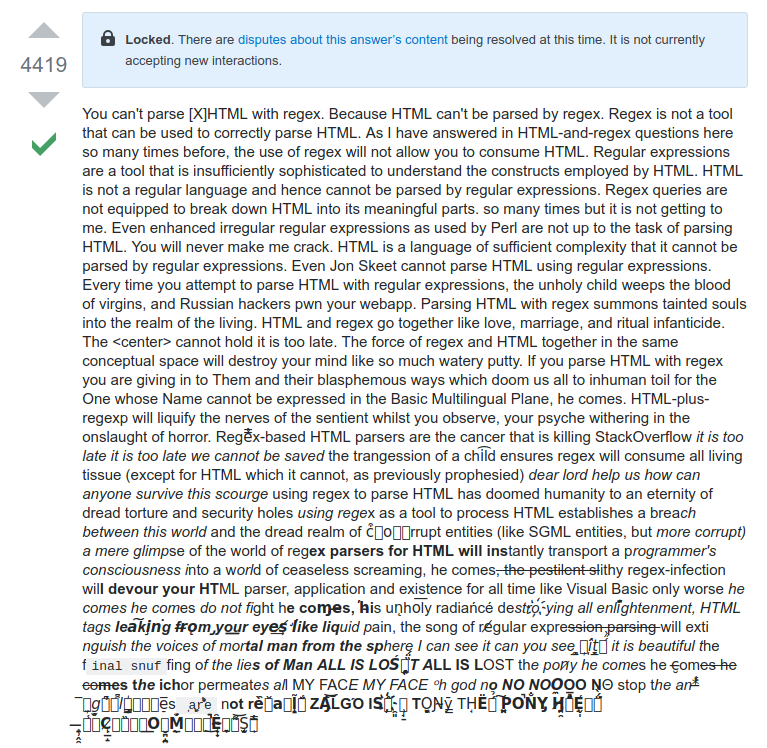

# HV19.06 bacon and eggs

**Task:**

*F*ra*n*cis Baco*n* *w*a*s* *a*n E*ng*lish ph*i*l*os*o*p*her a*n*d *s*tat*e*sm*a*n w*h*o se*rve*d *a*s At*t*or*n*ey Gen*e*ral and as *L*or*d* *Ch*an*ce*l*l*or of *En*g*l*an*d*. Hi*s* *w*orks ar*e* c*red*it*e*d w*ith* d*e*ve*lo*pi*ng* *t*h*e* sci*e*nt*i*fic me*t*hod and re*m*ai*ned* in*fl*u*en*ti*al* th*rou*gh *t*he s*cien*tific *r*ev*o*l*u*ti*o*n. *B*a*co*n h*as* *b*e*e*n ca*l*led *th*e *f*ath*e*r o*f* emp*iric*i*s*m. *Hi*s *wor*ks ar*g*ued for th*e* po*ssi*bi*li*t*y* of s*c*ie*n*tifi*c* *kno*wl*edg*e b*a*se*d* onl*y* u*p*on i*n*du*c*t*i*ve *r*ea*s*onin*g* *a*nd c*aref*u*l* o*bs*er*v*ation o*f* *e*v*e*nt*s* in *na*tur*e*. Mo*st* *i*mp*ort*an*t*l*y*, *he* a*rgue*d sc*i*en*c*e co*uld* *b*e *a*c*hi*eved by us*e* of a *s*ce*p*t*ical* a*nd* me*t*hod*i*ca*l* *a*pp*roa*ch wh*er*eby *s*cientist*s* ai*m* t*o* avo*i*d m*i*sl*ead*in*g* themsel*ve*s. *A*lth*oug*h *h*is *p*ra*c*tic*a*l i*d*e*a*s ab*out**s*u*ch* *a* *m*et*h*od, *t*he B*a*con*i*an meth*o*d, d*i*d no*t* have *a* l*o*n*g*-*la*s*t*ing *i*nfluen*c*e, *th*e *g*e*ne*ral *i*dea *of* *t*he imp*o*rta*n*ce and pos*s*i*b*il*it*y o*f*a s*c*ept*i*cal methodology makes Bacon the father of the scientific method. This method was a new rhetorical and theoretical framework for science, the practical details of which are still central in debates about science and methodology.

Bacon was the first recipient of the Queen's counsel designation, which was conferred in 1597 when Elizabeth I of England reserved Bacon as her legal advisor. After the accession of James VI and I in 1603, Bacon was knighted. He was later created Baron Verulam in 1618 and Viscount St. Alban in 1621. Because he had no heirs, both titles became extinct upon his death in 1626, at 65 years. Bacon died of pneumonia, with one account by John Aubrey stating that he had contracted the condition while studying the effects of freezing on the preservation of meat. He is buried at St Michael's Church, St Albans, Hertfordshire.

```
Born: January 22	     	 	   	   	 	       	     	  	  
Died: April 9   	  	 	    	  	      	   		  	  
Mother: Lady Anne   		 	   	   	      	  	      	  
Father: Sir Nicholas	 	      		    	    	  	  	      	      
Secrets: unknown     
```

**Flag:** `HV19{BACONCIPHERISSIMPLEBUTCOOL}`, the number `19` has to be added by hand.

# Research

Francis Bacon was smart and smart people like to develop ciphers, so googling for "Bacon crypto" lands a hit: 

* https://en.wikipedia.org/wiki/Bacon%27s_cipher
* https://www.dcode.fr/bacon-cipher

My first hunch considered the text between the tags to be relevant. This proved to be false. Cursorily reading Wikipedia entries early in the morning was not helpful.

However, the `<em>` tags to display the italicized letters differentiate only "marked" and "unmarked", i.e.  "marked" equals "binary 1" and "unmarked" equals "binary 0". So all letters between the `<em>`-tags are "1", outside "0". We must parse the HTML and transform it into ones, if they are enclosed within `<em>`-tags, and zeros if they're outside. But if you try parsing HTML with regex, little kitties instantly die or else:



https://stackoverflow.com/questions/1732348/regex-match-open-tags-except-xhtml-self-contained-tags/1732454#1732454

That's why you should use `html.parser` in Python (or whatever HTML-Parser there is).

``` python
import re
from html.parser import HTMLParser

class MyHTMLParser(HTMLParser):
    def __init__(self):  
        super().__init__()  
        self.in_em = False
        self.binary_bacon = ""

    def handle_starttag(self, tag, attrs):
        if tag == "em":
            self.in_em = True

    def handle_endtag(self, tag):
        if tag == "em":
            self.in_em = False

    def handle_data(self, data):
        pattern = re.compile(r"[\s,.!?]")
        data = pattern.sub("", data)
        char = "1" if self.in_em else "0"

        self.binary_bacon += (char * len(data))

def chunk(elems, n):
    for i in range(0, len(elems), n):
        yield elems[i:i + n]

bacon = "<p><em>F</em>ra<em>n</em>cis Baco<em>n</em> <em>w</em>a<em>s</em> <em>a</em>n E<em>ng</em>lish ph<em>i</em>l<em>os</em>o<em>p</em>her a<em>n</em>d <em>s</em>tat<em>e</em>sm<em>a</em>n w<em>h</em>o se<em>rve</em>d <em>a</em>s At<em>t</em>or<em>n</em>ey Gen<em>e</em>ral and as <em>L</em>or<em>d</em> <em>Ch</em>an<em>ce</em>l<em>l</em>or of <em>En</em>g<em>l</em>an<em>d</em>. Hi<em>s</em> <em>w</em>orks ar<em>e</em> c<em>red</em>it<em>e</em>d w<em>ith</em> d<em>e</em>ve<em>lo</em>pi<em>ng</em> <em>t</em>h<em>e</em> sci<em>e</em>nt<em>i</em>fic me<em>t</em>hod and re<em>m</em>ai<em>ned</em> in<em>fl</em>u<em>en</em>ti<em>al</em> th<em>rou</em>gh <em>t</em>he s<em>cien</em>tific <em>r</em>ev<em>o</em>l<em>u</em>ti<em>o</em>n.<em>B</em>a<em>co</em>n h<em>as</em> <em>b</em>e<em>e</em>n ca<em>l</em>led <em>th</em>e <em>f</em>ath<em>e</em>r o<em>f</em> emp<em>iric</em>i<em>s</em>m. <em>Hi</em>s <em>wor</em>ks ar<em>g</em>ued for th<em>e</em> po<em>ssi</em>bi<em>li</em>t<em>y</em> of s<em>c</em>ie<em>n</em>tifi<em>c</em> <em>kno</em>wl<em>edg</em>e b<em>a</em>se<em>d</em> onl<em>y</em> u<em>p</em>on i<em>n</em>du<em>c</em>t<em>i</em>ve <em>r</em>ea<em>s</em>onin<em>g</em> <em>a</em>nd c<em>aref</em>u<em>l</em> o<em>bs</em>er<em>v</em>ation o<em>f</em> <em>e</em>v<em>e</em>nt<em>s</em> in <em>na</em>tur<em>e</em>. Mo<em>st</em> <em>i</em>mp<em>ort</em>an<em>t</em>l<em>y</em>, <em>he</em> a<em>rgue</em>d sc<em>i</em>en<em>c</em>e co<em>uld</em> <em>b</em>e <em>a</em>c<em>hi</em>eved by us<em>e</em> of a <em>s</em>ce<em>p</em>t<em>ical</em> a<em>nd</em> me<em>t</em>hod<em>i</em>ca<em>l</em> <em>a</em>pp<em>roa</em>ch wh<em>er</em>eby <em>s</em>cientist<em>s</em> ai<em>m</em> t<em>o</em> avo<em>i</em>d m<em>i</em>sl<em>ead</em>in<em>g</em> themsel<em>ve</em>s. <em>A</em>lth<em>oug</em>h <em>h</em>is <em>p</em>ra<em>c</em>tic<em>a</em>l i<em>d</em>e<em>a</em>s ab<em>out</em> <em>s</em>u<em>ch</em> <em>a</em> <em>m</em>et<em>h</em>od, <em>t</em>he B<em>a</em>con<em>i</em>an meth<em>o</em>d, d<em>i</em>d no<em>t</em> have <em>a</em> l<em>o</em>n<em>g</em>-<em>la</em>s<em>t</em>ing <em>i</em>nfluen<em>c</em>e, <em>th</em>e <em>g</em>e<em>ne</em>ral <em>i</em>dea <em>of</em> <em>t</em>he imp<em>o</em>rta<em>n</em>ce and pos<em>s</em>i<em>b</em>il<em>it</em>y o<em>f</em> a s<em>c</em>ept<em>i</em>cal methodology makes Bacon the father of the scientific method. This method was a new rhetorical and theoretical frameworkf or science, the practical details of which are still central in debates about science and methodology.</p>"

parser = MyHTMLParser()
parser.feed(bacon)
print(parser.binary_bacon)

```

Since my brain heard the weekend call, I refrained from implementing the decryption process myself but rather pasted the output to  a friendly website: 
https://www.dcode.fr/bacon-cipher.

My initial attempt was futile, since I forgot to eliminate all punctuation marks and whitespace. A regex fixed that and revealed the flag.
