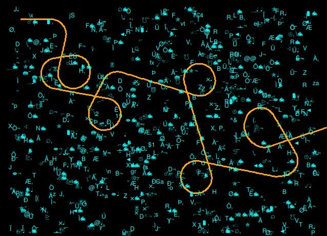

# HV19.14 Achtung das Flag

**Task:** Let's play another little game this year. Once again, I promise it is hardly obfuscated.

```perl
use Tk;use MIME::Base64;chomp(($a,$a,$b,$c,$f,$u,$z,$y,$r,$r,$u)=<DATA>);sub M{$M=shift;##
@m=keys %::;(grep{(unpack("%32W*",$_).length($_))eq$M}@m)[0]};$zvYPxUpXMSsw=0x1337C0DE;###
/_help_me_/;$PMMtQJOcHm8eFQfdsdNAS20=sub{$zvYPxUpXMSsw=($zvYPxUpXMSsw*16807)&0xFFFFFFFF;};
($a1Ivn0ECw49I5I0oE0='07&3-"11*/(')=~y$!-=$`-~$;($Sk61A7pO='K&:P3&44')=~y$!-=$`-~$;m/Mm/g;
($sk6i47pO='K&:R&-&"4&')=~y$!-=$`-~$;;;;$d28Vt03MEbdY0=sub{pack('n',$fff[$S9cXJIGB0BWce++]
^($PMMtQJOcHm8eFQfdsdNAS20->()&0xDEAD));};'42';($vgOjwRk4wIo7_=MainWindow->new)->title($r)
;($vMnyQdAkfgIIik=$vgOjwRk4wIo7_->Canvas("-$a"=>640,"-$b"=>480,"-$u"=>$f))->pack;@p=(42,42
);$cqI=$vMnyQdAkfgIIik->createLine(@p,@p,"-$y"=>$c,"-$a"=>3);;;$S9cXJIGB0BWce=0;$_2kY10=0;
$_8NZQooI5K4b=0;$Sk6lA7p0=0;$MMM__;$_=M(120812).'/'.M(191323).M(133418).M(98813).M(121913)
.M(134214).M(101213).'/'.M(97312).M(6328).M(2853).'+'.M(4386);s|_||gi;@fff=map{unpack('n',
$::{M(122413)}->($_))}m:...:g;($T=sub{$vMnyQdAkfgIIik->delete($t);$t=$vMnyQdAkfgIIik->#FOO
createText($PMMtQJOcHm8eFQfdsdNAS20->()%600+20,$PMMtQJOcHm8eFQfdsdNAS20->()%440+20,#Perl!!
"-text"=>$d28Vt03MEbdY0->(),"-$y"=>$z);})->();$HACK;$i=$vMnyQdAkfgIIik->repeat(25,sub{$_=(
$_8NZQooI5K4b+=0.1*$Sk6lA7p0);;$p[0]+=3.0*cos;$p[1]-=3*sin;;($p[0]>1&&$p[1]>1&&$p[0]<639&&
$p[1]<479)||$i->cancel();00;$q=($vMnyQdAkfgIIik->find($a1Ivn0ECw49I5I0oE0,$p[0]-1,$p[1]-1,
$p[0]+1,$p[1]+1)||[])->[0];$q==$t&&$T->();$vMnyQdAkfgIIik->insert($cqI,'end',\@p);($q==###
$cqI||$S9cXJIGB0BWce>44)&&$i->cancel();});$KE=5;$vgOjwRk4wIo7_->bind("<$Sk61A7pO-n>"=>sub{
$Sk6lA7p0=1;});$vgOjwRk4wIo7_->bind("<$Sk61A7pO-m>"=>sub{$Sk6lA7p0=-1;});$vgOjwRk4wIo7_#%"
->bind("<$sk6i47pO-n>"=>sub{$Sk6lA7p0=0 if$Sk6lA7p0>0;});$vgOjwRk4wIo7_->bind("<$sk6i47pO"
."-m>"=>sub{$Sk6lA7p0=0 if $Sk6lA7p0<0;});$::{M(7998)}->();$M_decrypt=sub{'HACKVENT2019'};
__DATA__
The cake is a lie!
width
height
orange
black
green
cyan
fill
Only perl can parse Perl!
Achtung das Flag! --> Use N and M
background
M'); DROP TABLE flags; -- 
Run me in Perl!
__DATA__
```

**Flag:** `HV19{s@@jSfx4gPcvtiwxPCagrtQ@,y^p-za-oPQ^a-z\x20\n^&&s[(.)(..)][\2\1]g;s%4(...)%"p$1t"%ee}`

# Research

As a gamer I just *had* to solve this challenge. But then, Perl.

But also: Snakes on a plane!

You play a typical "Snake" game, where the snake has to eat the flag, two characters at a time. Every time the snake eats a character pair, the next pair is displayed. Since it's Snake and the controls are only for hardcore players after > 800 hours experience, chances to win are nil. So I have to hack the game to win.

However, if you tinker too much with the code (e.g. rename the variables), the output on the canvas changes or the game breaks. It's a snake that eats itself! Still it's possible to identify the relevant parts. 

The following is responsible for calculating the characters and printing them on the screen. If you comment out the first line, it doesn't delete the characters:

```perl
($T=sub{#$vMnyQdAkfgIIik->delete($t);  
# = don't delete current char if it's eaten by the snake
    $t=$vMnyQdAkfgIIik->#FOO
createText($PMMtQJOcHm8eFQfdsdNAS20->()%600+20,$PMMtQJOcHm8eFQfdsdNAS20->()%440+20,
# determines position of next chars
"-text"=>$d28Vt03MEbdY0->(),"-$y"=>$z); # d28Vt03MEbdY0 holds the text to be displayed
    })->();
```

Another code snippet later is responsible for controlling the movements of the snake and its behavior. If we tweak the code, we can keep the game running even if the snake runs into itself:

``` perl
$i=$vMnyQdAkfgIIik->repeat(25,sub{
    $_=($_8NZQooI5K4b+=0.1*$Sk6lA7p0);;
    $p[0]+=3.0*cos;
    $p[1]-=3*sin;;
    ($p[0]>1&&
        $p[1]>1&&
        $p[0]<639&&
        $p[1]<479)
    || $i->cancel();
    00;
    $q=($vMnyQdAkfgIIik->find($a1Ivn0ECw49I5I0oE0,$p[0]-1,$p[1]-1,$p[0]+1,$p[1]+1)
        ||[])->[0];
    $q==$t||$T->();  # used to be $q==$t&&$T->();
    $vMnyQdAkfgIIik->insert($cqI,'end',\@p);
    ($q==###
        $cqI||$S9cXJIGB0BWce>44);
   # &&$i->cancel() # = do not stop if snake runs into itself
});
```

`$q==$t&&$T->();` is the part which checks if the snake hit a character. If we change it to `$q==$t||$T->();`, the expression is always true and all characters are printed at every iteration, not only when they are hit by the snake.

Please appreciate this modern art at this point:



Since the characters are printed too fast (and my memory is bad), I also want all these characters seen on stdout, not only on the canvas. This is achieved by tweaking the code which is responsible for generating the text. `d28Vt03MEbdY0` is the variable name we encountered in the function `createText()`:

```perl
$d28Vt03MEbdY0=sub{
	# $snek is a varaible defined by myself
    $snek=pack('n',$fff[$S9cXJIGB0BWce++]^($PMMtQJOcHm8eFQfdsdNAS20->()&0xDEAD));
    print STDOUT $snek  # the characters we want to see on stdout
    };
```

The output on stdout is the flag:

```bash
$ perl snakesonaplane.pl
HV19{s@@jSfx4gPcvtiwxPCagrtQ@,y^p-za-oPQ^a-z\x20\n^&&s[(.)(..)][\2\1]g;s%4(...)%"p$1t"%ee}�,��ΠP,�%    
```

Much fun was had!