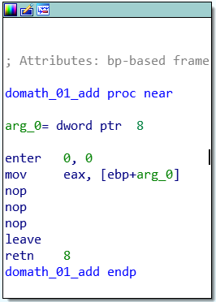
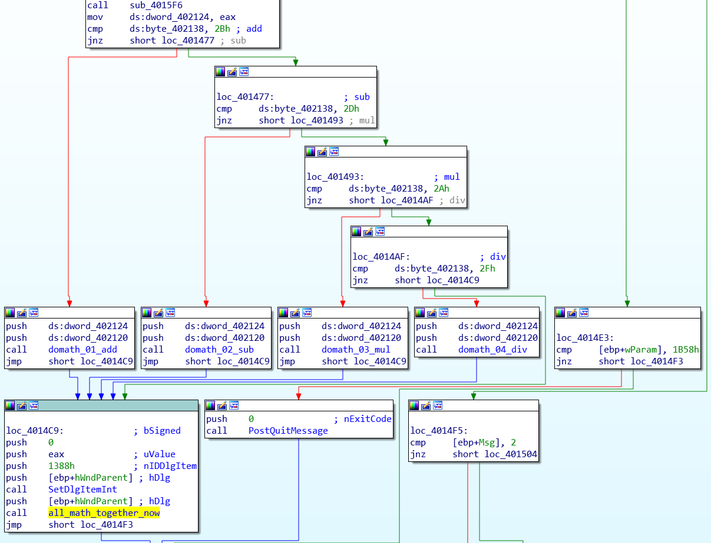
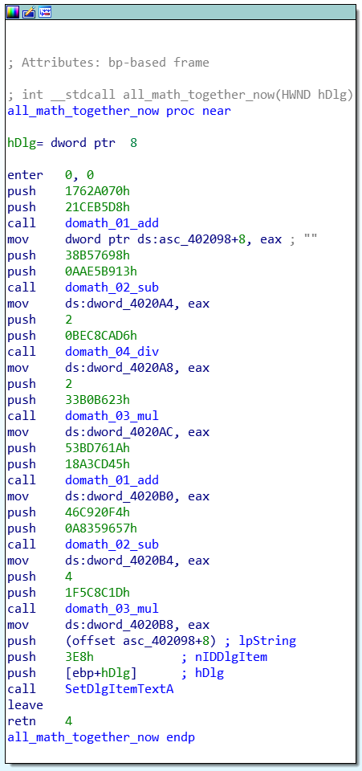

# HV19.16 B0rked Calculator

**Task:** Santa has coded a simple project for you, but sadly he removed all the operations. But when you restore them it will print the flag!

**Flag:** `HV19{B0rked_Flag_Calculat0r}`

# Research

The binary is a small windows "calculator" where you can perform addition, subtraction, multiplication, and division. A quick look however reveals: The relevant functions to do the math are filled with `nop` instructions. From the length of the functions and missing operations we can already infer their respective operation, e.g. I assume the shortest to be addition:



The main routine shows the switch-case that decides which operation to perform, equivalent to the drop-down in the GUI. The `cmp`-check for each case reveals the operations encoded as ASCII-value (e.g. `2B` is `+`):



The interesting part is the function I named `all_math_together_now`:



It shows several calls to the math functions (filled with `nop`) to perform some calculations with defined values. After every calculation the result is saved to a string. This means we can write our own calculator without the need to replace the `nop`-operations with the correct opcodes. The first operation would then be in Python:

```python
v1_2 = int(0x1762A070)
v1_1 = int(0x21CEB5D8)
v1_result = hex(v1_1 + v1_2) # = "0x39315648"
```

`0x39315648` is the same as `'9', '1', 'V', 'H'` in ASCII, thus the beginning of the flag in little endian. Performing each calculation results in the following values:

``` python
0x39315648
0x7230427b
0x5f64656b
0x67616c46
0x6c61435f
0x616c7563
0x7d723074
```

Each chopped up into bytes, read as ASCII and reversed finally reveals the flag.