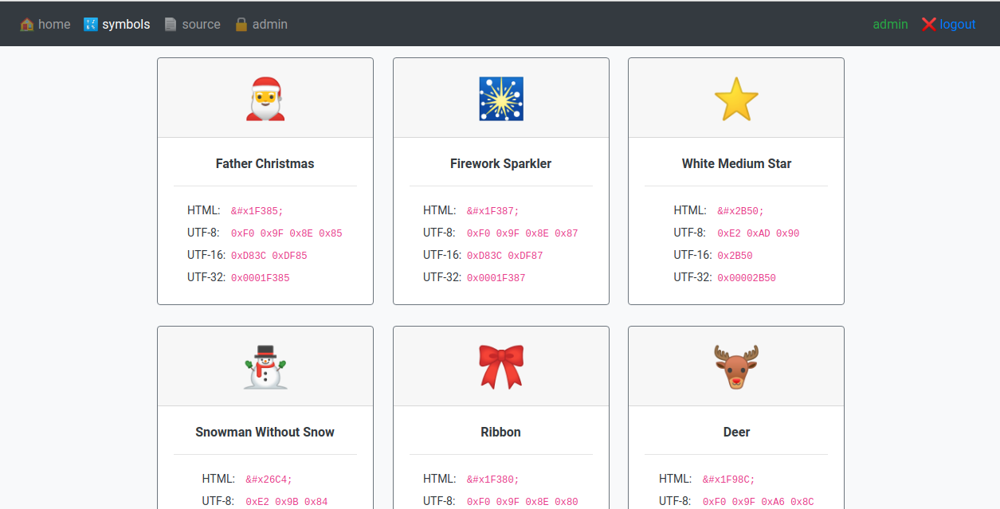

# HV19.17 Unicode Portal

**Task:** Buy your special gifts online, but for the ultimative gift you have to become admin.
 Site: http://whale.hacking-lab.com:8881/

**Flag:** `HV19{h4v1ng_fun_w1th_un1c0d3}` 

# Research

When we read about Unicode, first we must thank the Unicode consortium gods for their existence (no more borked emails from around the globe!). Then we proceed.

I've already read about a phishing trick using Unicode^1^, so of course some trick had to exist for logins too. Mimicking Anonymous didn't do the trick^2^, but after some more googling I read about Unicode mapping collisions.^3^ This essentially means that two different characters are uppercased or lowercased into the same character, e.g. `ß` turns into `SS`.

I first registered as `admın` with the password `bork`, to use a collision from the Turkish `ı` to Latin `i`. This allows to login as user `admin` with password `bork` as well:



However, the source code reveals that during Christmas, all admins turn into santas! 

``` php
function isAdmin($username) {
  return ($username === 'santa');
}
```

Another collision maps `ſ` to `s`. After creating an account with user `ſanta` and password `claus`, we can also login as `santa` with the same password `claus`. The flag is then revealed on the admin page: `HV19{h4v1ng_fun_w1th_un1c0d3}`. Thanks, Unicode gods!

1. https://www.xudongz.com/blog/2017/idn-phishing/
2. https://security.stackexchange.com/questions/11391/how-did-anonymous-use-utf-16-ascii-to-fool-php-escaping
3. https://eng.getwisdom.io/awesome-unicode/